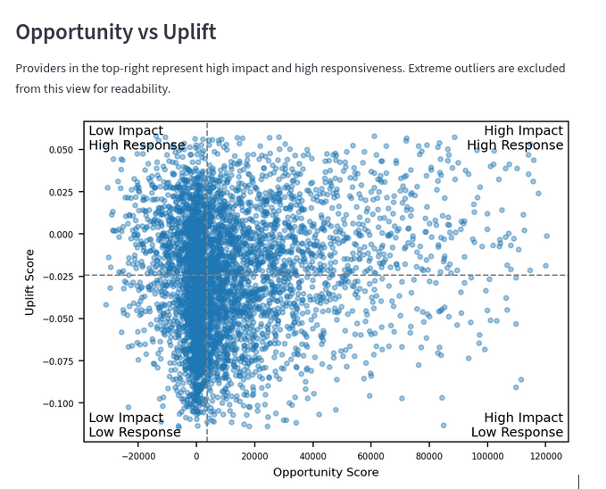

# Site-of-Care Optimization

## Overview
A healthcare analytics project that identifies provider-level opportunities to shift procedures from higher-cost hospital settings to lower-cost ambulatory surgical centers (ASC).

This project simulates a value-based care use case by combining provider benchmarking, opportunity scoring, predictive modeling, uplift modeling, and dashboard-based exploration.

## Tech Stack
- **Languages:** Python, SQL  
- **Data & ML:** pandas, scikit-learn  
- **Cloud:** AWS (S3, Redshift, Athena)  
- **Visualization:** Matplotlib, Seaborn, Streamlit  
- **Config & Dev:** YAML, GitHub  

## Key Features

- Provider benchmarking against regional peers
- Opportunity scoring based on utilization and cost gaps
- Predictive modeling for high-cost site-of-care patterns
- Uplift modeling to estimate provider responsiveness to intervention
- Streamlit dashboard for interactive exploration

## Results Preview



## Project Structure

```text
siteofshift/
├── src/siteofshift/
├── config/
│   └── ui.yaml
├── data/
├── results/
├── tests/
├── Dockerfile
├── pyproject.toml
└── README.md
```


## Author 
Yingchun Chen
Senior Healthcare Data Analyst | Data Science & Analytics