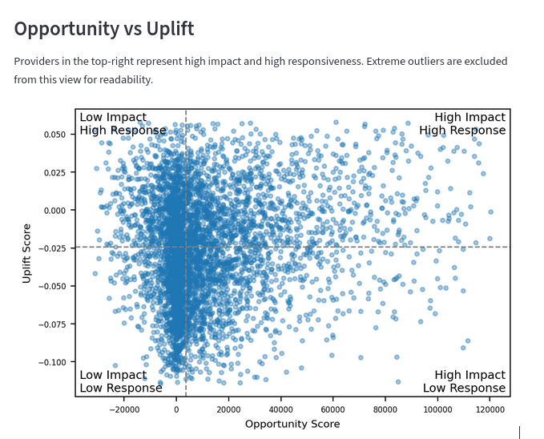

# Site-of-Care Optimization | Healthcare Analytics Project

## Overview

A conceptual healthcare analytics simulation that demonstrates a provider-level screening and prioritization framework for identifying potential site-of-care opportunities using synthetic data.

The simulated cohort represents services for which a lower‑acuity alternative setting may be clinically appropriate for selected patients. For simplicity, the broader site‑of‑care continuum is modeled using three settings: inpatient (IP), hospital outpatient department (HOPD), and ambulatory surgical center (ASC), with ASC serving as the lower‑acuity alternative site. Administrative data can highlight potential opportunities for further review; patient‑level clinical appropriateness remains outside the scope of this simulation.

This project integrates provider benchmarking, opportunity scoring, predictive modeling, exploratory uplift modeling, and interactive dashboarding to illustrate a value-based care analytics workflow.

> All data and intervention responses are synthetic. Results are illustrative and should not be interpreted as estimates of realized savings, clinical appropriateness, or real-world causal treatment effects.


## Tech Stack

- **Languages:** Python  
- **Data & ML:** Pandas, NumPy, scikit-learn  
- **Visualization:** Matplotlib, Seaborn, Streamlit
- **Config & Dev:** YAML, GitHub  

## Key Features

- Provider benchmarking against regional peers
- Opportunity screening based on below-benchmark ASC use and above-benchmark average cost
- Relative opportunity scoring based on procedure volume, ASC shortfall, and excess cost
- Predictive modeling for high-cost site-of-care patterns
- Exploratory T-learner modeling to illustrate modeled responsiveness and targeting mechanics
- Streamlit dashboard for interactive exploration

## Design and Methodology

- Simulation framework using synthetic provider-level data and conceptual healthcare data models
- Three modeled site categories: IP, HOPD, and ASC; ASC serves as a simplified lower-acuity alternative site
- Volume-weighted regional benchmarking of ASC utilization and average cost
- One-sided opportunity score: procedure volume × ASC shortfall × excess cost
- Exploratory uplift modeling based on a simulated treatment-response function
- Visualization of opportunity vs. modeled response trade-offs
  
## Results Preview

The simulation generates 5,000 provider observations. In the reproducible output, 1,661 (33.2%) meet the positive opportunity-screening criteria. The opportunity-versus-response visualization uses 1,597 observations after trimming values outside the 1st–99th percentiles of either the opportunity score or modeled intervention response for readability.

Opportunity scores are relative prioritization signals, not estimates of realized savings.



## Project Structure

```text
siteofshift/
├── src/siteofshift/
├── config/
│   └── ui.yaml
├── data/
├── results/
├── tests/
├── Dockerfile
├── pyproject.toml
└── README.md
```

## How to Run
### Using uv  
  
```bash  
# Sync dependencies  
uv sync  
  
# Run tests  
PYTHONPATH=src uv run --active pytest  
  
# Run pipeline  
PYTHONPATH=src uv run --active python -m siteofshift.main  
  
# Run dashboard  
PYTHONPATH=src uv run --active streamlit run src/siteofshift/dashboard.py
```


### Using Docker

```bash
# Build image
docker build -t siteofshift .

# Run pipeline in Docker
docker run --rm -v $(pwd)/results:/app/results siteofshift

# Run dashboard in Docker
docker run --rm -p 8501:8501 \
  -v $(pwd)/results:/app/results \
  siteofshift \
  uv run python -m streamlit run src/siteofshift/dashboard.py \
  --server.address 0.0.0.0 \
  --server.port 8501
```


## Author 
Yingchun Chen
Senior Healthcare Data Analyst | Data Science & Analytics

## LICENCE
MIT License
